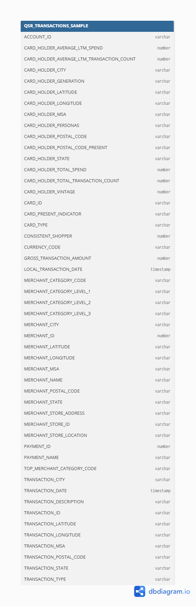

## **1\. Úvod a popis zdrojových dát**

Témou projektu je analýza spotrebiteľských transakcií v segmente rýchleho občerstvenia a QSR (Quick Service Restaurants). Projekt ponúka pohľad do správania zákazníkov – od toho, kde radi nakupujú, cez ktoré reštaurácie si najčastejšie vyberajú, až po trendy vo výdavkoch podľa vekových skupín a regiónov. Tieto dáta umožňujú firmám robiť strategické rozhodnutia založené na reálnych nákupných vzorcoch a zostať o krok pred konkurenciou.

Projekt podporuje viaceré kľúčové biznis procesy:
 - Poznajte svojich zákazníkov: segmentujte ich podľa veku, lokality a nákupného správania.
 - Objavte trendy a obľúbené reštaurácie: identifikujte, ktoré značky a kategórie získavajú najviac pozornosti.
 - Optimalizujte ponuky a kampane: využite dáta na presné zacielenie marketingu a zlepšenie konverzií.
 - Benchmarkujte trh: porovnajte nákupné správanie vašich zákazníkov s priemyselnými trendmi a konkurenciou.

Údaje pochádzajú z [**Credit/Debit Transactions: Fast Food and Quick Service Restaurants**](https://app.snowflake.com/marketplace/listing/GZSTZ708I0X/facteus-credit-debit-transactions-fast-food-and-quick-service-restaurants?categorySecondary=%5B%226%22%5D&pricing=free).

V tabuľke nájdete informácie ako:
 - GROSS_TRANSACTION_AMOUNT – celková hodnota každej transakcie
 - TRANSACTION_DATE – dátum a presný čas nákupu
 - MERCHANT_NAME – názov reštaurácie alebo prevádzky
 - MERCHANT_CATEGORY_CODE – typ a kategória obchodu
 - MERCHANT_POSTAL_CODE – lokalita prevádzky
 - CARD_HOLDER_GENERATION – veková kategória zákazníka
 - CARD_HOLDER_POSTAL_CODE – približná geografická poloha zákazníka
 - CARD_PRESENT_INDICATOR – indikátor online vs. osobnej transakcie

Cieľom procesu ELT bolo pripraviť údaje na transformáciu a následnú analýzu.

**1.1 Dátová architektúra**

---
