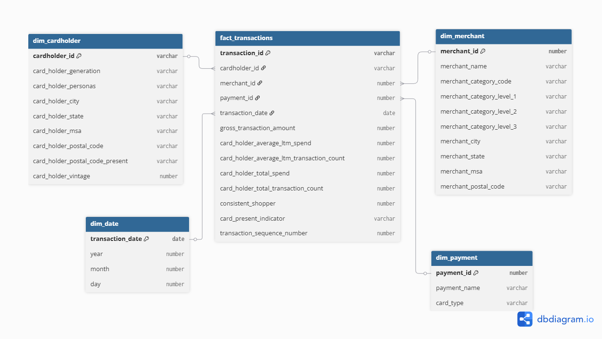
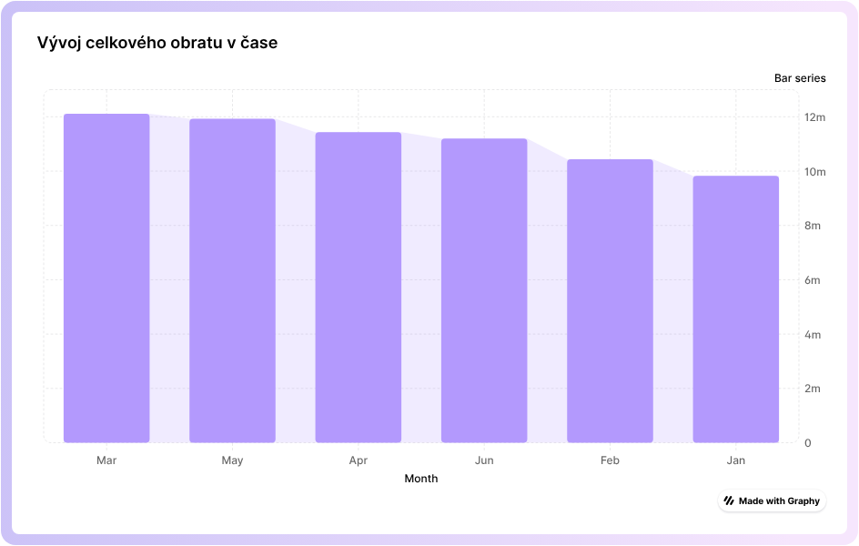
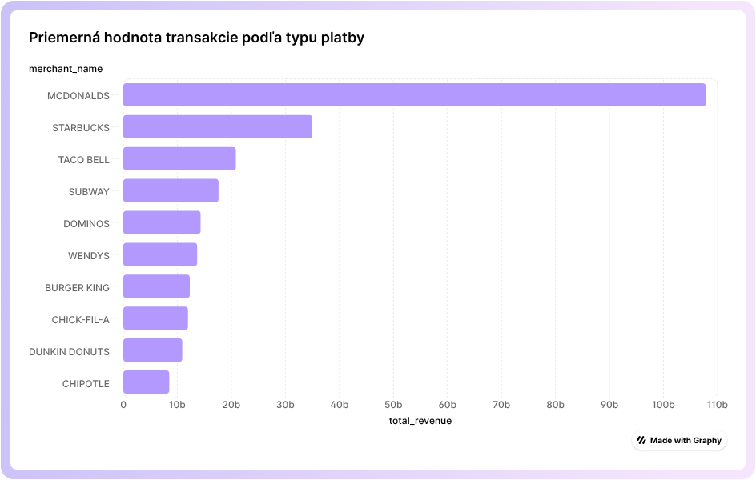
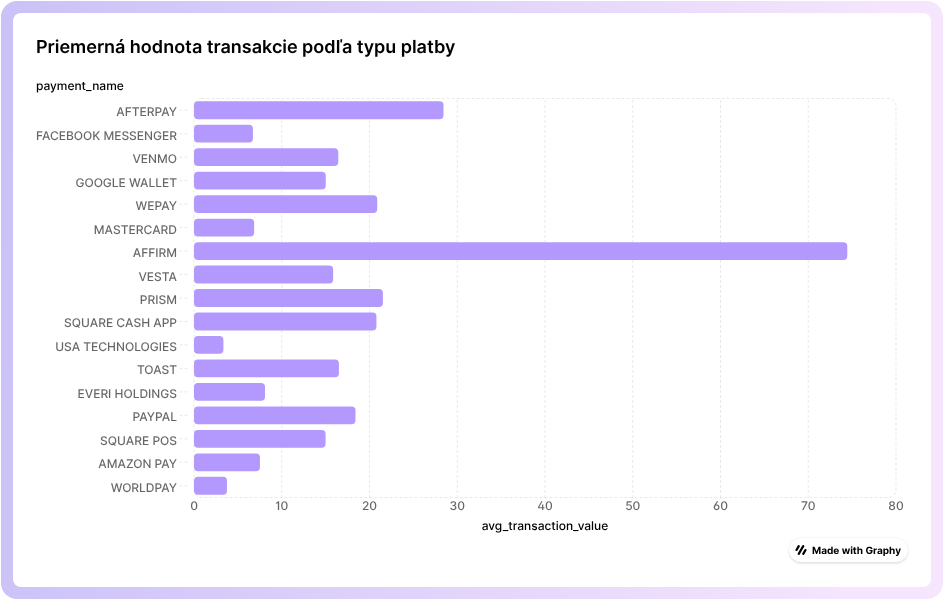
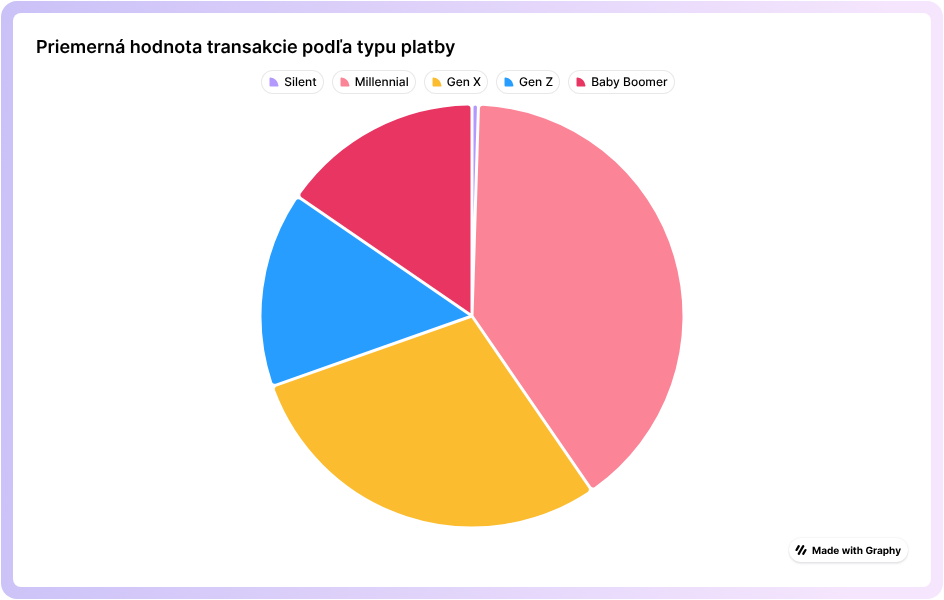
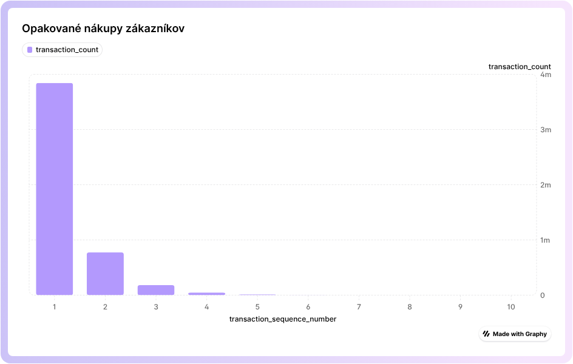

## **1\. Úvod a popis zdrojových dát**

Témou projektu je analýza spotrebiteľských transakcií v segmente rýchleho občerstvenia a QSR (Quick Service Restaurants). Projekt ponúka pohľad do správania zákazníkov – od toho, kde radi nakupujú, cez ktoré reštaurácie si najčastejšie vyberajú, až po trendy vo výdavkoch podľa vekových skupín a regiónov. Tieto dáta umožňujú firmám robiť strategické rozhodnutia založené na reálnych nákupných vzorcoch a zostať o krok pred konkurenciou.

Projekt podporuje viaceré kľúčové biznis procesy:
 - Poznajte svojich zákazníkov: segmentujte ich podľa veku, lokality a nákupného správania.
 - Objavte trendy a obľúbené reštaurácie: identifikujte, ktoré značky a kategórie získavajú najviac pozornosti.
 - Optimalizujte ponuky a kampane: využite dáta na presné zacielenie marketingu a zlepšenie konverzií.
 - Benchmarkujte trh: porovnajte nákupné správanie vašich zákazníkov s priemyselnými trendmi a konkurenciou.

Údaje pochádzajú z [**Credit/Debit Transactions: Fast Food and Quick Service Restaurants**](https://app.snowflake.com/marketplace/listing/GZSTZ708I0X/facteus-credit-debit-transactions-fast-food-and-quick-service-restaurants?categorySecondary=%5B%226%22%5D&pricing=free).

V tabuľke nájdete informácie ako:
 - GROSS_TRANSACTION_AMOUNT – celková hodnota každej transakcie
 - TRANSACTION_DATE – dátum a presný čas nákupu
 - MERCHANT_NAME – názov reštaurácie alebo prevádzky
 - MERCHANT_CATEGORY_CODE – typ a kategória obchodu
 - MERCHANT_POSTAL_CODE – lokalita prevádzky
 - CARD_HOLDER_GENERATION – veková kategória zákazníka
 - CARD_HOLDER_POSTAL_CODE – približná geografická poloha zákazníka
 - CARD_PRESENT_INDICATOR – indikátor online vs. osobnej transakcie

Cieľom procesu ELT bolo pripraviť údaje na transformáciu a následnú analýzu.

---

**1.1 Dátová architektúra**

Diagram nižšie znázorňuje ERD pôvodnej dátovej štruktúry zdrojového datasetu, ktorý je dostupný vo forme denormalizovaného view a obsahuje všetky atribúty potrebné pre následnú transformáciu do dimenzionálneho modelu.


---

## **2\. Dimenzionálny model**

Pre účely analýzy spotrebiteľských transakcií v reštauráciách typu Fast Food a Quick Service bol navrhnutý hviezdicový model (star schema) podľa Kimballovej metodológie. Model obsahuje jednu faktovú tabuľku a štyri dimenzie, ktoré poskytujú kompletný kontext pre každú transakciu:
 - dim_cardholder – obsahuje údaje o držiteľovi karty, ako je generácia, segmentačný typ (persona), mesto, štát, poštové smerovacie číslo a dĺžka vzťahu k banke (vintage). Vzťah k faktovej tabuľke je 1:N, SCD typu 1, keďže demografické a základné segmentačné údaje sa nemenia často.
 - dim_merchant – obsahuje údaje o obchode, kde sa transakcia uskutočnila: názov, kategórie obchodu na rôznych úrovniach, mesto, štát, MSA a poštové smerovacie číslo. Vzťah k faktovej tabuľke je 1:N, SCD typu 1.
 - dim_payment – obsahuje údaje o platobnej karte: identifikátor platby, názov platobnej metódy a typ karty (debetná/kreditná). Vzťah k faktovej tabuľke je 1:N, SCD typu 1, keďže typ platby je stabilný.
 - dim_date – obsahuje časové charakteristiky dátumu transakcie: dátum, rok, mesiac a deň. Vzťah k faktovej tabuľke je 1:N, SCD typu 0, pretože dátum je statický a nemení sa.
 - fact_transactions – obsahuje jednotlivé transakcie ako záznamy na úrovni jednej transakcie. Primárnym kľúčom je transaction_id, tabuľka obsahuje cudzie kľúče na všetky dimenzie a hlavné metriky: gross_transaction_amount,   card_holder_average_ltm_spend, card_holder_average_ltm_transaction_count, card_holder_total_spend, card_holder_total_transaction_count, consistent_shopper a indikátor, či bola karta fyzicky prítomná. Okrem toho obsahuje aj analytický stĺpec transaction_sequence_number, ktorý určuje poradie nákupov každého držiteľa karty pomocou window funkcie ROW_NUMBER(). Tento stĺpec umožňuje sledovať opakované nákupy a analyzovať nákupné správanie zákazníkov.

Dimenzie boli navrhnuté s ohľadom na Slowly Changing Dimensions:
 - dim_cardholder, dim_merchant a dim_payment sú implementované ako SCD Typ 1, pretože historické zmeny ich atribútov (napr. zmena mesta, kategórie alebo typu platby) nie sú pre analytické účely sledované a vždy sa pracuje s aktuálnou hodnotou.
 - dim_date je typu SCD Typ 0, keďže dátumové atribúty (rok, mesiac, deň) sú nemenné a nemenia sa v čase.

Prepojenie faktovej tabuľky a dimenzií
Faktová tabuľka je centrom hviezdice, pričom každá dimenzia poskytuje kontext pre transakciu:
cardholder_id → dim_cardholder
merchant_id → dim_merchant
payment_id → dim_payment
transaction_date → dim_date



---
## **3\. ELT proces v Snowflake**

ELT proces pozostáva z troch hlavných fáz: extrahovanie (Extract), načítanie (Load) a transformácia (Transform). Tento proces som implementoval v Snowflake s cieľom pripraviť zdrojové dáta zo staging vrstvy do viacdimenzionálneho modelu typu hviezda vhodného na analýzu a vizualizáciu.

---

**3.1 Extract (Extrahovanie dát)**

Dáta zo zdrojového datasetu „Credit/Debit Transactions: Fast Food and Quick Service Restaurants“, som sprístupnil prostredníctvom existujúceho view poskytovaného marketplace. Dataset obsahuje detailné informácie o kartových transakciách v segmente rýchleho občerstvenia (QSR), vrátane údajov o zákazníkoch, obchodníkoch, platbách a časových charakteristikách transakcií.

Pre účely ďalšieho spracovania som vytvoril staging tabuľku, ktorá slúži ako dočasná pracovná vrstva pre načítanie surových dát bez transformácií.

**Kód:**

```sql
CREATE OR REPLACE TABLE transactions_staging AS
SELECT * FROM CREDITDEBIT_TRANSACTIONS_FAST_FOOD_AND_QUICK_SERVICE_RESTAURANTS.SNOWFLAKE_MARKETPLACE.QSR_TRANSACTIONS_SAMPLE;
```

---

**3.2 Load (Načítanie dát)**

V tejto časti som už vytvoril počiatočný vzhľad star-schémy s faktovými a dimenčnými tabuľkami. Momentálne je tu veľa zbytočných a netriedených informácií. Zatiaľ máme tabuľky fact_transactions, dim_cardholder, dim_merchant, dim_transaction, dim_payment.

**Kód:**
```sql
-- Dimenzia Cardholder
CREATE OR REPLACE TABLE dim_cardholder AS
SELECT DISTINCT
    ACCOUNT_ID AS cardholder_id,
    CARD_ID,
    CARD_TYPE,
    CARD_HOLDER_GENERATION,
    CARD_HOLDER_PERSONAS,
    CARD_HOLDER_VINTAGE,
    CARD_HOLDER_CITY,
    CARD_HOLDER_STATE,
    CARD_HOLDER_POSTAL_CODE,
    CARD_HOLDER_POSTAL_CODE_PRESENT,
    CARD_HOLDER_MSA,
    CARD_HOLDER_LATITUDE,
    CARD_HOLDER_LONGITUDE
FROM HIPPO_TRANSACTIONS_DB.PUBLIC.TRANSACTIONS_STAGING;

-- Dimenzia Merchant
CREATE OR REPLACE TABLE dim_merchant AS
SELECT DISTINCT
    MERCHANT_ID AS,
    MERCHANT_NAME,
    MERCHANT_CATEGORY_CODE,
    TOP_MERCHANT_CATEGORY_CODE,
    MERCHANT_CATEGORY_LEVEL_1,
    MERCHANT_CATEGORY_LEVEL_2,
    MERCHANT_CATEGORY_LEVEL_3,
    MERCHANT_STORE_ID,
    MERCHANT_STORE_ADDRESS,
    MERCHANT_STORE_LOCATION,
    MERCHANT_CITY,
    MERCHANT_STATE,
    MERCHANT_POSTAL_CODE,
    MERCHANT_MSA,
    MERCHANT_LATITUDE,
    MERCHANT_LONGITUDE
FROM HIPPO_TRANSACTIONS_DB.PUBLIC.TRANSACTIONS_STAGING;

-- Dimenzia Payment
CREATE OR REPLACE TABLE dim_payment AS
SELECT DISTINCT
    PAYMENT_ID,
    PAYMENT_NAME,
    CARD_TYPE
FROM HIPPO_TRANSACTIONS_DB.PUBLIC.TRANSACTIONS_STAGING;

-- Dimenzia Date, location
CREATE OR REPLACE TABLE dim_transaction AS
SELECT DISTINCT
    TRANSACTION_DATE,
    TRANSACTION_CITY,
    TRANSACTION_STATE,
    TRANSACTION_POSTAL_CODE,
    TRANSACTION_MSA,
    TRANSACTION_LATITUDE,
    TRANSACTION_LONGITUDE,
    TRANSACTION_DESCRIPTION
FROM HIPPO_TRANSACTIONS_DB.PUBLIC.TRANSACTIONS_STAGING;

```

```sql
CREATE OR REPLACE TABLE fact_transactions AS
SELECT
    TRANSACTION_ID AS transaction_id,
    ACCOUNT_ID AS cardholder_id,
    MERCHANT_ID AS merchant_id,
    PAYMENT_ID AS payment_id,
    TRANSACTION_DATE AS transaction_date,
    GROSS_TRANSACTION_AMOUNT,
    CARD_HOLDER_AVERAGE_LTM_SPEND,
    CARD_HOLDER_AVERAGE_LTM_TRANSACTION_COUNT,
    CARD_HOLDER_TOTAL_SPEND,
    CARD_HOLDER_TOTAL_TRANSACTION_COUNT,
    CONSISTENT_SHOPPER,
    CARD_PRESENT_INDICATOR,
    TRANSACTION_TYPE,
    CURRENCY_CODE
FROM HIPPO_TRANSACTIONS_DB.PUBLIC.TRANSACTIONS_STAGING;

```
---

**3.3 Transformácia dát**

V Transform fáze som dáta zo staging a Load tabuliek očistil, zredukoval a zjednotil do finálnej hviezdicovej schémy vhodnej pre analýzu. Hlavné zmeny oproti Load fáze boli:
Odstránené nadbytočné alebo duplicitné stĺpce, napríklad presné geografické údaje transakcií (TRANSACTION_LATITUDE, TRANSACTION_LONGITUDE).
Dimenzie boli zjednodušené tak, aby obsahovali len analyticky relevantné atribúty:
 - dim_cardholder → demografické a segmentačné údaje o držiteľoch kariet
 - dim_merchant → identifikácia obchodov a kategórie
 - dim_payment → údaje o platbách vrátane typu karty
 - dim_date → časové charakteristiky transakcie (rok, mesiac, deň)

Faktová tabuľka fact_transactions obsahuje iba merateľné hodnoty a cudzie kľúče do dimenzií.

**Window funkcia**
V fact_transactions bola použitá window funkcia ROW_NUMBER():
ROW_NUMBER() OVER (PARTITION BY cardholder_id ORDER BY transaction_date) AS transaction_sequence_number.
Slúži na určenie poradia transakcií každého zákazníka.
 Umožňuje analýzu nákupného správania, napr. identifikovať prvý nákup, opakované nákupy alebo lojalitu zákazníka.
 Partition podľa cardholder_id znamená, že poradie sa počíta samostatne pre každého držiteľa karty.
 Order podľa transaction_date zabezpečuje chronologické zoradenie transakcií.

**Kód:**
```sql
-- Dimenzia Date
CREATE OR REPLACE TABLE dim_date AS
SELECT DISTINCT
    CAST(transaction_date AS DATE) AS transaction_date,
    EXTRACT(YEAR FROM transaction_date) AS year,
    EXTRACT(MONTH FROM transaction_date) AS month,
    EXTRACT(DAY FROM transaction_date) AS day
FROM dim_transaction;

-- Dimenzia Cardholder
CREATE OR REPLACE TABLE dim_cardholder AS
SELECT DISTINCT
    cardholder_id,
    card_holder_generation,
    card_holder_personas,
    card_holder_city,
    card_holder_state,
    card_holder_msa,
    card_holder_postal_code,
    card_holder_postal_code_present,
    card_holder_vintage
FROM dim_cardholder;

-- Dimenzia Merchant
CREATE OR REPLACE TABLE dim_merchant AS
SELECT DISTINCT
    merchant_id,
    merchant_name,
    merchant_category_code,
    merchant_category_level_1,
    merchant_category_level_2,
    merchant_category_level_3,
    merchant_city,
    merchant_state,
    merchant_msa,
    merchant_postal_code
FROM dim_merchant;


CREATE OR REPLACE TABLE dim_payment AS
SELECT DISTINCT
    payment_id,
    payment_name,
    card_type
FROM dim_payment;

```

```sql
CREATE OR REPLACE TABLE fact_transactions AS
SELECT
    transaction_id,
    cardholder_id,
    merchant_id,
    payment_id,
    CAST(transaction_date AS DATE) AS transaction_date,
    gross_transaction_amount,
    card_holder_average_ltm_spend,
    card_holder_average_ltm_transaction_count,
    card_holder_total_spend,
    card_holder_total_transaction_count,
    consistent_shopper,
    card_present_indicator,
    ROW_NUMBER() OVER (
        PARTITION BY cardholder_id
        ORDER BY transaction_date
    ) AS transaction_sequence_number
FROM fact_transactions;
```
---
## **4. Vizualizácia dát**

**Graf 1: Vývoj celkového obratu v čase**  
Graf zobrazuje vývoj spotrebiteľských výdavkov v QSR segmente počas sledovaného obdobia. Je možné identifikovať rastové alebo poklesové trendy, sezónnosť a obdobia zvýšenej spotreby.
```sql
SELECT
    d.year,
    d.month,
    SUM(f.gross_transaction_amount) AS total_revenue
FROM fact_transactions f
JOIN dim_date d ON f.transaction_date = d.transaction_date
GROUP BY d.year, d.month
ORDER BY d.year, d.month;
```


---

**Graf 2: Najvýznamnejší obchodníci podľa obratu**  
Vizualizácia poukazuje na dominantných hráčov v segmente rýchleho občerstvenia. Výsledky môžu byť použité na analýzu trhového postavenia jednotlivých značiek.
```sql
SELECT
    m.merchant_name,
    SUM(f.gross_transaction_amount) AS total_revenue
FROM fact_transactions f
JOIN dim_merchant m ON f.merchant_id = m.merchant_id
GROUP BY m.merchant_name
ORDER BY total_revenue DESC
LIMIT 10;
```


---

**Graf 3: Priemerná hodnota transakcie podľa typu platby**  
Graf ukazuje rozdiely v správaní zákazníkov podľa spôsobu platby. Napríklad kreditné karty môžu mať vyššiu priemernú hodnotu transakcie než debetné.
```sql
SELECT
    p.payment_name,
    AVG(f.gross_transaction_amount) AS avg_transaction_value
FROM fact_transactions f
JOIN dim_payment p ON f.payment_id = p.payment_id
GROUP BY p.payment_name;
```


---

**Graf 4: Rozdelenie obratu podľa generácie zákazníkov**  
Vizualizácia znázorňuje podiel jednotlivých vekových skupín na celkových tržbách. Výsledky sú vhodné pre marketingové cielenie a segmentáciu zákazníkov.
```sql
SELECT
    c.card_holder_generation,
    SUM(f.gross_transaction_amount) AS total_revenue
FROM fact_transactions f
JOIN dim_cardholder c ON f.cardholder_id = c.cardholder_id
GROUP BY c.card_holder_generation;

```


---

**Graf 5: Opakované nákupy zákazníkov (lojalita)**  
Graf vychádza z window funkcie ROW_NUMBER() a umožňuje analyzovať lojalitu zákazníkov. Je možné identifikovať, koľko zákazníkov uskutoční iba jeden nákup a koľko sa vracia opakovane.
```sql
SELECT
    transaction_sequence_number,
    COUNT(*) AS transaction_count
FROM fact_transactions
GROUP BY transaction_sequence_number
ORDER BY transaction_sequence_number;
```


**Autor:** Volodymyr Ivanov
